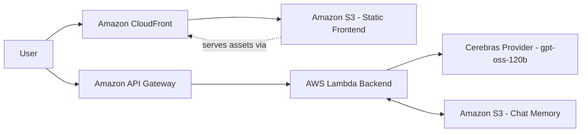
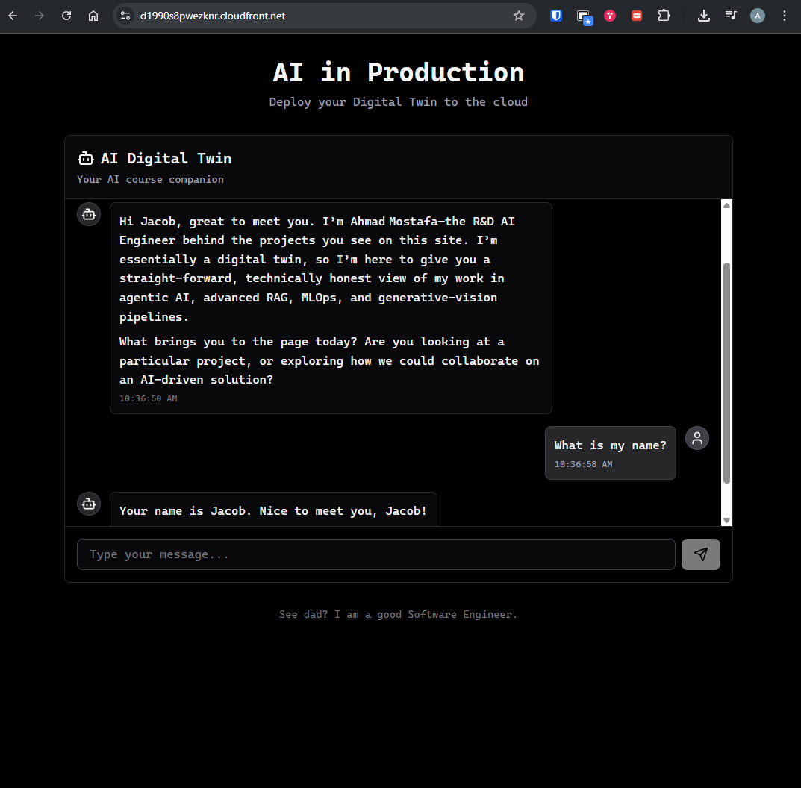

# Twin

AI twin application deployed on AWS with a static frontend, serverless backend, and external model inference.

## Architecture Overview

- Frontend: static website hosted on Amazon S3 and delivered through Amazon CloudFront.
- Backend: AWS Lambda behind Amazon API Gateway.
- Model provider: Cerebras using `gpt-oss-120b`.
- Chat memory: stored in Amazon S3.

## AWS + Inference Flow

## Workspace Structure

- `frontend/`: UI application.
- `backend/`: Lambda/API logic and backend resources.
- `memory/`: local memory-related assets/config used during development.

## Project Image 

<!-- Paste your architecture/work image in this section -->

